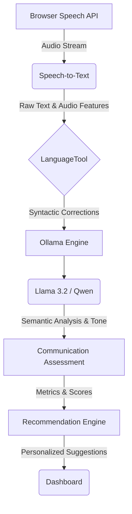

# AI Architecture: CommuniAble AI

This document outlines the core AI architecture for the CommuniAble AI platform, an AI-powered Workplace Communication Training Platform for Persons with Disabilities.

## Architectural Overview

The AI architecture is designed to process both spoken and written communication inputs, evaluate them against professional workplace standards, and provide actionable, real-time feedback without relying on generic conversational AI paradigms.

### Core Workflow Pipeline

The AI workflow strictly follows this linear processing pipeline:

1.  **Input Capture**: Browser Speech API / Text Input
2.  **Transcription**: Speech-to-Text Processing
3.  **Syntactic Analysis**: LanguageTool
4.  **Local Inference Engine**: Ollama
5.  **Semantic & Contextual Analysis**: Llama 3.2 / Qwen
6.  **Evaluation**: Communication Assessment
7.  **Personalization**: Recommendation Engine
8.  **Presentation**: Dashboard

## Pipeline Component Details

### 1. Browser Speech API
- Acts as the primary auditory interface for the user.
- Captures raw audio input from the user's microphone securely within the browser environment.
- Performs initial silence detection and noise gating before passing the audio stream forward.

### 2. Speech-to-Text
- Transcribes the captured audio into raw text data.
- Extracts acoustic features such as timestamps for pauses, hesitations, and word duration to aid in downstream fluency analysis.

### 3. LanguageTool
- Acts as the first-pass syntactic filter.
- Performs rule-based grammar, spelling, and style checking.
- Flags fundamental grammatical errors before the computationally expensive LLM processing, reducing the workload on the semantic engine.

### 4. Ollama
- Serves as the local inference server, managing the loading, execution, and resource allocation for the Large Language Models.
- Ensures data privacy by keeping all text processing on the local machine or private server, critical for processing sensitive workplace communication data.

### 5. Llama 3.2 / Qwen
- The core semantic processing engines.
- **Llama 3.2**: Utilized for complex contextual understanding, tone analysis, and generating structured feedback on professional communication nuances.
- **Qwen**: Utilized for rapid parsing, categorization of communication weaknesses, and generating alternative phrasings for workplace scenarios.

### 6. Communication Assessment
- An aggregation layer that compiles data from the Speech-to-Text module (fluency, pace), LanguageTool (grammar), and the LLMs (tone, context).
- Computes normalized scores across predefined communication metrics (e.g., Clarity, Professionalism, Confidence).

### 7. Recommendation Engine
- Analyzes the output from the Communication Assessment layer against the user's historical performance data.
- Generates targeted practice scenarios and identifies specific communication areas requiring focus based on weakness logs.

### 8. Dashboard
- The visual presentation layer for the user.
- Displays real-time feedback, historical progress charts, and personalized recommendations generated by the pipeline.

## System Diagram

