# Database Design: CommuniAble AI

## 1. Overview
The database for CommuniAble AI is designed to securely and efficiently manage user profiles, accessibility preferences, speech/writing assessments, and progress tracking for workplace communication training. The architecture heavily relies on PostgreSQL (via Supabase) with Row Level Security (RLS) policies to ensure data privacy across distinct roles (Learner, Trainer, Institution, Admin).

## 2. Entity-Relationship (ER) Diagram

```mermaid
erDiagram
    users ||--o{ profiles : "1:1"
    profiles ||--o{ accessibility_profiles : "1:1"
    profiles ||--o{ speech_assessments : "has"
    profiles ||--o{ writing_assessments : "has"
    speech_assessments ||--o{ speech_reports : "generates"
    writing_assessments ||--o{ writing_reports : "generates"
    profiles ||--o{ mock_interviews : "participates"
    mock_interviews ||--o{ interview_responses : "contains"
    interview_questions ||--o{ interview_responses : "answered in"
    profiles ||--o{ simulation_sessions : "participates"
    simulation_sessions ||--o{ simulation_results : "produces"
    vocabulary_categories ||--o{ vocabulary_words : "contains"
    profiles ||--o{ vocabulary_progress : "tracks"
    vocabulary_words ||--o{ vocabulary_progress : "measured by"
    profiles ||--o{ practice_sessions : "completes"
    profiles ||--o{ learning_paths : "assigned to"
    profiles ||--o{ recommendations : "receives"
    profiles ||--o{ progress : "logs"
    profiles ||--o{ achievements : "earns"
    profiles ||--o{ trainer_notes : "written about"
    profiles ||--o{ trainer_reports : "authored by/about"
    profiles ||--o{ institution_reports : "belongs to"
    profiles ||--o{ notifications : "receives"
    profiles ||--o{ settings : "configures"
    profiles ||--o{ activity_logs : "generates"
```

## 3. Key Relationships
- **Users to Profiles**: 1-to-1 relationship linking authentication identities to application-specific user data.
- **Profiles to Accessibility Profiles**: 1-to-1 relationship defining bespoke UI/UX and interaction settings (e.g., contrast, screen reader optimization, cognitive load reduction).
- **Assessments & Reports**: 1-to-Many relationships where a user can have multiple assessments over time, each generating specific detailed reports.
- **Interviews & Simulations**: Relational structures capturing interactive sessions, linking standard questions to user responses and evaluated results.

## 4. Indexing & Optimization Strategies
- **Primary Keys**: UUID v4 for all tables to ensure global uniqueness and obfuscate sequential data from potential enumeration attacks.
- **Foreign Keys**: Enforced referential integrity with `ON DELETE CASCADE` where appropriate (e.g., deleting a user deletes their profile and related assessments).
- **GIN Indexes**: Applied to JSONB columns (e.g., detailed AI feedback, raw transcripts) to enable fast document-based querying.
- **B-Tree Indexes**: Applied on frequently filtered columns like `user_id`, `created_at`, `status`, and `category_id`.

## 5. Security & Constraints
- **Row Level Security (RLS)**: Enabled on all tables. Users can only read/write their own data unless they hold a 'Trainer' or 'Institution' role with specific access grants.
- **Check Constraints**: Ensure valid enum values for roles, status fields, and assessment scores (e.g., scores must be between 0 and 100).
