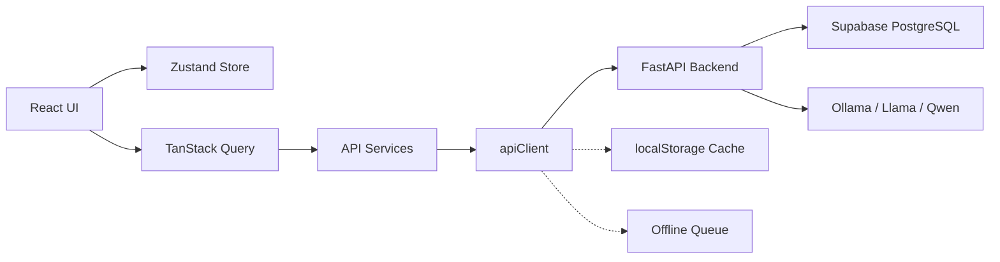

# ExpressAble AI — Architecture Documentation

> Empowering Every Voice, One Conversation at a Time.

## Overview

ExpressAble AI is an enterprise-grade, AI-powered communication learning platform that helps users improve speech, writing, vocabulary, and workplace communication through personalized AI feedback, mock interviews, and social simulations.

## Tech Stack

| Layer | Technology |
|---|---|
| Frontend | Next.js 16 (App Router), React 19, TypeScript |
| Styling | Tailwind CSS 4, CSS Variables Design System |
| State (Client) | Zustand 5 (auth, UI, notifications, communication) |
| State (Server) | TanStack React Query 5 (cached API data) |
| Animations | Framer Motion 12 |
| Validation | Zod 4 |
| Forms | React Hook Form 7 |
| Icons | Lucide React |
| Backend | FastAPI (Python 3.11+) |
| Database | Supabase PostgreSQL with RLS |
| AI Models | Ollama (Llama, Qwen), OpenAI-compatible APIs |
| CI/CD | GitHub Actions |
| Deployment | Vercel (frontend), Cloud (backend) |

## Frontend Architecture

```
src/
├── app/               # Next.js App Router pages (19 routes)
├── components/        # Reusable UI components
│   ├── ui/            # Primitives (Button, FormControls)
│   ├── common/        # Shared widgets (SpeechRecorder, DataDisplay)
│   ├── layout/        # NavigationLayout, Sidebar, Header
│   └── accessibility/ # AccessibilityToolbar, KeyboardHelper
├── contexts/          # React Contexts (Accessibility, Auth)
├── hooks/             # Custom hooks (useApiQuery, useMicrophone)
├── lib/               # Core infrastructure
│   ├── apiClient.ts   # Enhanced fetch client with retry/interceptors
│   ├── ai.ts          # AI provider abstraction
│   ├── supabase.ts    # Supabase client placeholder
│   ├── errors.ts      # Centralized error handling
│   ├── logger.ts      # Observability utilities
│   ├── cache.ts       # localStorage cache + offline queue
│   └── fileUpload.ts  # File management utilities
├── providers/         # QueryProvider (TanStack)
├── services/          # Module-specific API services
├── store/             # Zustand stores
├── types/             # TypeScript interfaces
├── utils/             # Utilities (api.ts, motion.ts, cn)
├── styles/            # Global CSS
└── constants/         # App constants
```

## Route Map

| Route | Purpose |
|---|---|
| `/` | Landing page |
| `/login` | Authentication |
| `/signup` | Registration |
| `/forgot-password` | Password recovery |
| `/reset-password` | Password reset |
| `/verify-email` | Email verification |
| `/onboarding` | New user onboarding |
| `/dashboard` | Learner dashboard |
| `/assessment/speech` | Speech assessment module |
| `/assessment/writing` | Writing & grammar coach |
| `/vocabulary` | Vocabulary learning |
| `/simulation` | Workplace simulations |
| `/interview` | Mock interview hub |
| `/settings` | Profile, analytics, privacy |
| `/portal` | Enterprise management (Trainer/Institution/Admin) |
| `/help` | Help center & support |

## State Management

### Client State (Zustand)
- **useAuthStore** — JWT token, user profile, auth lifecycle
- **useCommunicationStore** — Scores, XP, streaks, active sessions
- **useNotificationStore** — Notifications list, unread count, preferences
- **useUIStore** — Sidebar, modals, global search, online status

### Server State (TanStack Query)
- Cached with 5-minute stale time, 2 retries, no refetch on window focus
- Hooks: `useDashboard`, `useProgress`, `useRecommendations`, `useVocabulary`, `useNotifications`, `useAnalytics`

## Authentication Flow

1. User submits credentials → `POST /auth/login`
2. Backend returns JWT + user profile
3. Token stored in `localStorage` under `auth_token`
4. `apiClient` auto-injects token on every request
5. On 401 → attempt silent refresh via `POST /auth/refresh`
6. On refresh failure → clear tokens, redirect to login

## Multi-Role Architecture

| Role | Dashboard | Capabilities |
|---|---|---|
| Learner | `/dashboard` | Practice, assessments, progress tracking |
| Trainer | `/portal` (trainer tab) | Learner management, feedback, reports |
| Institution | `/portal` (institution tab) | Org analytics, enrollment trends |
| Admin | `/portal` (admin tab) | User management, audit logs, system health |

## AI Provider Abstraction

```typescript
interface AIProvider {
  complete(prompt, options?): Promise<AIResponse>;
  analyzeSpeech(audioUrl): Promise<SpeechAnalysisResult>;
  analyzeWriting(text): Promise<WritingAnalysisResult>;
}
```

Default provider: `FastAPIProvider` (routes to backend endpoints). Swappable via `aiService.setProvider(...)`.

## Data Flow



## Accessibility

- WCAG 2.2 Level AA compliance throughout
- `AccessibilityContext` manages theme (light/dark/high-contrast), font size, dyslexic font, reduced motion
- Settings persisted to `localStorage` and applied to `<html>` root
- All interactive elements have visible focus indicators
- Screen reader announcements via `aria-live="polite"` regions
- Semantic HTML5 landmarks and proper heading hierarchy
